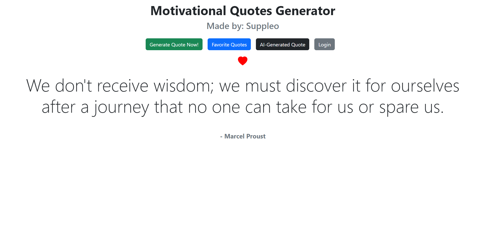
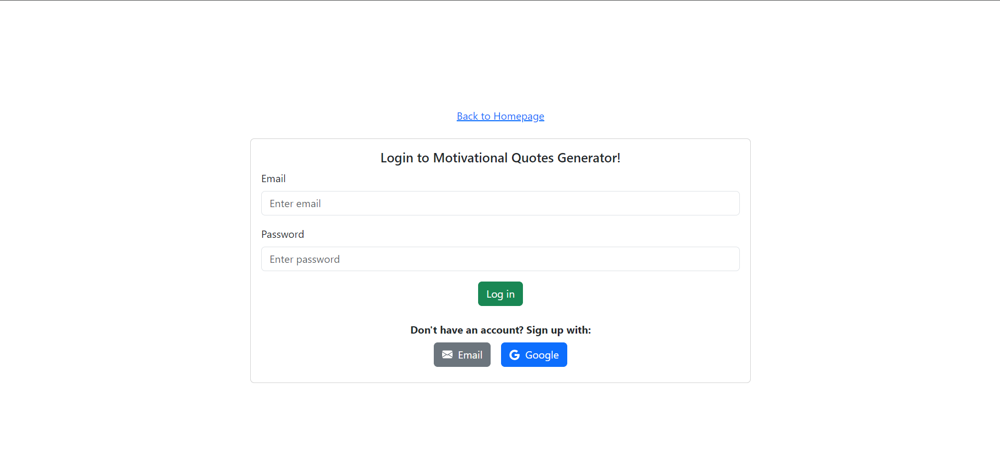
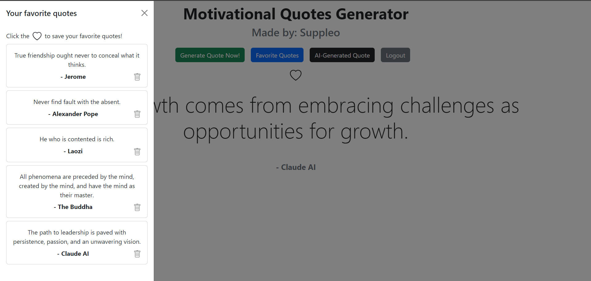
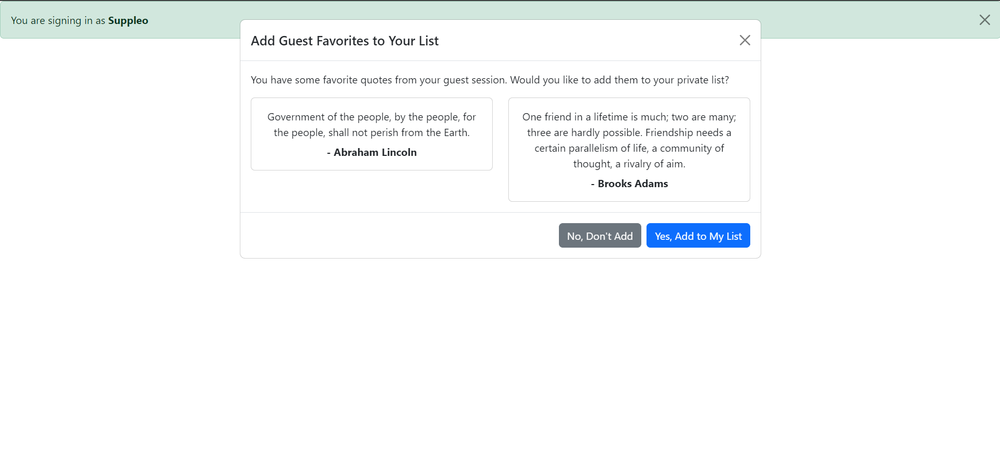

# Motivational Quotes Generator

## Table of Contents

- [Description and Demo](#description-and-demo)
- [Images](#images)
- [Features](#features)
- [Technologies Used](#technologies-used)
- [Installation](#installation)
- [Usage](#usage)
- [Authentication](#authentication)
- [Contributing](#contributing)

## Description and Demo

The Motivational Quotes Generator is a web application designed to inspire and motivate users with randomly generated quotes. Built with React and styled using Bootstrap, this app offers a sleek, modern interface for users to discover and save their favorite motivational quotes.

You can try the online demo of the application here: https://suppleo.github.io/Motivational-Quotes-Generator/

## Images






## Features

- Generate random motivational quotes
- Like and save favorite quotes
- View a list of saved favorite quotes
- Remove quotes from favorites
- User authentication (Email and Google Sign-In)
- Responsive design for various screen sizes

## Technologies Used

- React: A JavaScript library for building user interfaces
- Bootstrap 5.3: A popular CSS framework for responsive, mobile-first design
- Bootstrap Icons: Icon library for visual enhancements
- Firebase: Backend-as-a-Service (BaaS) for authentication and data storage
- Vite: A modern frontend build tool for faster development

## Installation

1. Clone the repository:

   ```
   git clone https://github.com/your-username/motivational-quotes-generator.git
   ```

2. Navigate to the project directory:

   ```
   cd motivational-quotes-generator
   ```

3. Install dependencies:

   ```
   npm install
   ```

4. Create a `.env` file in the root directory and add your Firebase configuration:

   ```
   VITE_FIREBASE_API_KEY=your_api_key
   VITE_FIREBASE_AUTH_DOMAIN=your_auth_domain
   VITE_FIREBASE_PROJECT_ID=your_project_id
   VITE_FIREBASE_STORAGE_BUCKET=your_storage_bucket
   VITE_FIREBASE_MESSAGING_SENDER_ID=your_messaging_sender_id
   VITE_FIREBASE_APP_ID=your_app_id
   ```

5. Start the development server:
   ```
   npm run dev
   ```

## Usage

1. Open the app in your web browser.
2. Click the "Generate Quote" button to get a random motivational quote.
3. Like a quote by clicking the heart icon to add it to your favorites.
4. View your favorite quotes in the "Favorite Quotes" section.
5. Remove quotes from your favorites by clicking the trash icon.
6. Sign in to sync your favorites across devices.

## Authentication

The app supports two methods of authentication:

1. Email/Password: Users can create an account using their email address and a password.
2. Google Sign-In: Users can sign in with their Google account for a seamless experience.

To sign in:

1. Click the "Login" button in the app.
2. Choose either "Sign in with Email" or "Sign in with Google".
3. Follow the prompts to complete the authentication process.

Once signed in, your favorite quotes will be synced with your account and accessible across devices.

## Contributing

Contributions to the Motivational Quotes Generator are welcome! Please follow these steps:

1. Fork the repository.
2. Create a new branch: `git checkout -b feature/your-feature-name`.
3. Make your changes and commit them: `git commit -m 'Add some feature'`.
4. Push to the branch: `git push origin feature/your-feature-name`.
5. Submit a pull request.

---

Developed with ❤️ by Suppleo
